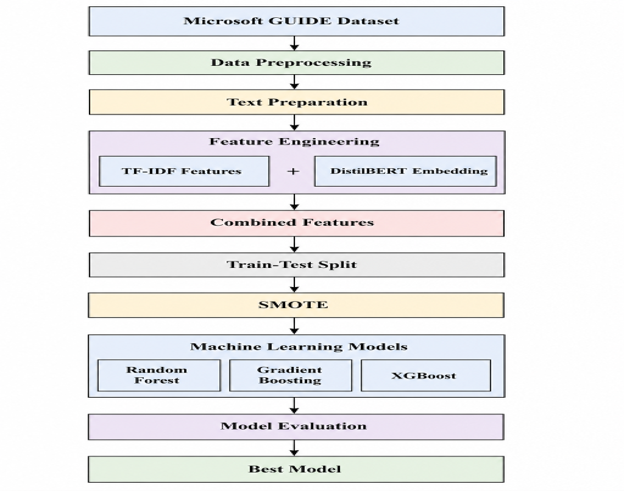
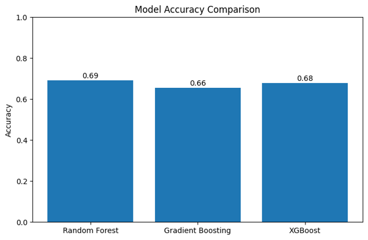
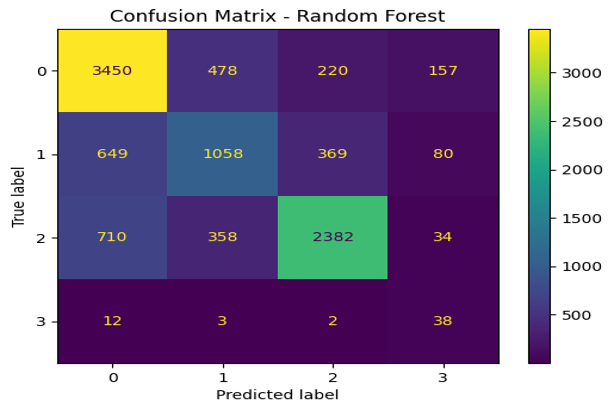
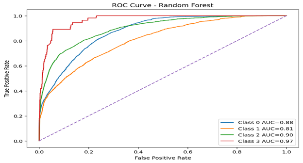
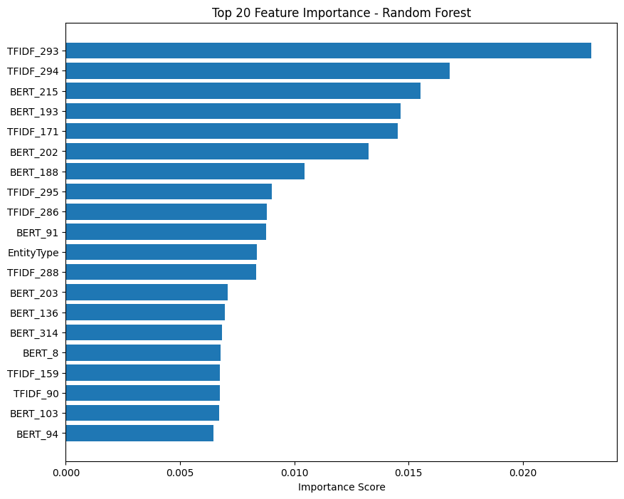
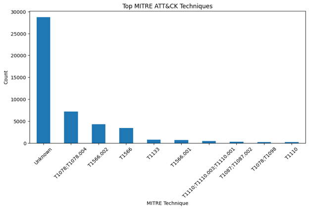

# Cybersecurity Incident Classification — NLP, ML & MITRE ATT&CK

Machine-learning classification of cybersecurity incidents using **TF-IDF, transformer-based sentence embeddings, structured security metadata, and MITRE ATT&CK context**.

This project evaluates a hybrid NLP and machine-learning pipeline on the Microsoft Security Incident Prediction (GUIDE) dataset and compares **Random Forest, Gradient Boosting, and XGBoost** for automated cybersecurity incident classification.

> **Best reported model:** Random Forest — **69.28% accuracy**, **0.6963 weighted F1-score**, and **75.96% cross-validation accuracy**.

---

## Project Overview

Security Operations Centres and IT security teams process large volumes of alerts, incidents, and security-related tickets.

Manual classification can be:

- Time-consuming
- Inconsistent
- Difficult to scale
- Dependent on analyst experience
- Challenging when incident descriptions overlap

This project investigates whether Natural Language Processing and machine learning can extract useful patterns from cybersecurity incident data to support automated classification and triage.

The experimental pipeline combines:

- Cybersecurity metadata
- MITRE ATT&CK information
- TF-IDF text representation
- Sentence-transformer embeddings
- Class-imbalance handling with SMOTE
- Ensemble machine-learning classifiers
- Multi-metric model evaluation

The work originated from a BSc Cyber Security dissertation and is presented here as a reproducible technical portfolio project using the original implementation and experimental evidence.

---

## Research Question

The project investigates whether textual and structured cybersecurity information can be combined to classify security incidents effectively and how different machine-learning approaches compare.

The research focused on:

1. Building a machine-learning framework for cybersecurity incident classification
2. Preprocessing structured and textual security data
3. Extracting lexical and contextual NLP features
4. Incorporating MITRE ATT&CK-related context
5. Comparing multiple ensemble classifiers
6. Analysing misclassification and class imbalance
7. Evaluating the practical limitations of automated cybersecurity classification

---

# Experimental Pipeline



The reported research workflow was:

```text
Microsoft GUIDE Dataset
        │
        ▼
Data Preprocessing
        │
        ▼
TicketText Construction
        │
        ▼
Feature Engineering
   ┌───────────────┐
   │               │
TF-IDF        Sentence Transformer
Features         Embeddings
   │               │
   └───────┬───────┘
           │
           ▼
Structured Security Metadata
           │
           ▼
    Combined Feature Set
           │
           ▼
     Train-Test Split
           │
           ▼
          SMOTE
           │
           ▼
   Machine-Learning Models
   ┌────────┼────────┐
   ▼        ▼        ▼
Random   Gradient   XGBoost
Forest   Boosting
   └────────┼────────┘
            ▼
      Model Evaluation
```

Full methodology:

**[View Methodology →](docs/methodology.md)**

---

# Dataset

The research used the **Microsoft Security Incident Prediction (GUIDE)** dataset.

The dissertation reports an experimental sample containing:

| Dataset Component | Records |
| --- | ---: |
| Total sample | **50,000** |
| Training set | **40,000** |
| Testing set | **10,000** |

The reported train-test split was:

```text
80% training
20% testing
```

Selected fields included:

```text
Category
MitreTechniques
EntityType
EvidenceRole
SuspicionLevel
LastVerdict
ThreatFamily
OSFamily
CountryCode
AlertTitle
IncidentGrade
```

The target variable used in the reported experiment was:

```text
IncidentGrade
```

The external dataset is **not redistributed through this repository**.

**[Dataset Documentation →](data/README.md)**

---

# Text & Feature Engineering

A central part of the project was creating a hybrid representation of each cybersecurity incident.

## TicketText

Several security attributes were combined into a derived textual representation called:

```text
TicketText
```

The reported methodology combined information including:

```text
AlertTitle
Category
MITRE ATT&CK Techniques
EntityType
ThreatFamily
LastVerdict
```

This provided richer context than relying on the alert title alone.

---

## TF-IDF

Traditional NLP features were generated using TF-IDF.

Configuration:

```text
Maximum features: 300
Stop words:       English
N-gram range:     (1, 2)
```

This representation captures explicit cybersecurity vocabulary and short phrase patterns.

Examples include terms relating to:

- Phishing
- Malware
- Credentials
- Login activity
- Suspicious behaviour
- Malicious activity

---

## Sentence Transformer Embeddings

Contextual sentence embeddings were generated using:

```text
all-MiniLM-L6-v2
```

through the Sentence Transformers library.

Unlike TF-IDF, contextual embeddings can represent semantic similarity even when two incident descriptions use different vocabulary.

> **Terminology note:** The original dissertation sometimes refers to this component as DistilBERT. The preserved implementation uses `SentenceTransformer("all-MiniLM-L6-v2")`, so this repository uses the more precise implementation terminology.

---

## Structured Security Metadata

Structured cybersecurity information was also incorporated into the feature representation.

This included attributes relating to:

- Incident category
- Entity type
- Threat family
- Security verdict
- Operating-system family
- MITRE ATT&CK techniques

Categorical values were numerically encoded for machine-learning processing.

---

## Hybrid Representation

The resulting design combined:

```text
TF-IDF
   +
Sentence Transformer Embeddings
   +
Structured Cybersecurity Metadata
        │
        ▼
Hybrid Feature Representation
```

The dissertation reports a final feature space containing:

```text
694 predictive features
```

**[Feature Engineering Details →](docs/feature-engineering.md)**

---

# Class Imbalance

The cybersecurity dataset contained uneven class distributions.

Synthetic Minority Oversampling Technique (**SMOTE**) was applied to the training data to improve representation of minority classes.

SMOTE generates synthetic minority-class observations rather than simply duplicating existing examples.

However, the final evaluation showed that class imbalance remained an important limitation.

This is particularly visible in the minority-class precision and confusion-matrix results.

---

# Machine-Learning Models

Three supervised ensemble classifiers were evaluated.

## Random Forest

Reported configuration:

```text
n_estimators:      150
max_depth:         15
min_samples_split: 5
class_weight:      balanced
```

## Gradient Boosting

Reported configuration:

```text
n_estimators: 100
learning_rate: 0.08
```

## XGBoost

Reported configuration:

```text
n_estimators: 150
learning_rate: 0.05
max_depth: 6
subsample: 0.8
```

The models were evaluated using a combination of held-out testing and cross-validation.

---

# Model Results

The dissertation reports:

| Model | Accuracy | Weighted F1 | Cross-Validation Accuracy |
| --- | ---: | ---: | ---: |
| **Random Forest** | **69.28%** | **0.6963** | **75.96%** |
| XGBoost | 67.99% | 0.6862 | 74.97% |
| Gradient Boosting | 65.61% | 0.6653 | 71.98% |

Random Forest achieved the strongest overall reported performance.



The models were relatively competitive, however, and the results should not be interpreted as evidence that Random Forest universally outperforms the other algorithms.

**[Full Model Evaluation →](docs/model-evaluation.md)**

---

# Confusion Matrix Analysis

Overall accuracy concealed substantial differences between incident classes.



The reported Random Forest confusion matrix was:

```text
                 Predicted
              0      1      2      3
          ┌──────────────────────────
Actual 0  │ 3450   478    220    157
Actual 1  │  649  1058    369     80
Actual 2  │  710   358   2382     34
Actual 3  │   12     3      2     38
```

Reported class-level metrics were:

| Class | Precision | Recall | F1-score |
| --- | ---: | ---: | ---: |
| Class 0 | 0.72 | 0.80 | 0.76 |
| Class 1 | 0.56 | 0.49 | 0.52 |
| Class 2 | 0.80 | 0.68 | 0.74 |
| Class 3 | 0.12 | 0.69 | 0.21 |

Classes 0 and 2 showed substantially stronger classification performance.

Class 3 demonstrated an important imbalance problem: relatively high recall but extremely low precision.

This highlights why **accuracy alone is insufficient** for evaluating cybersecurity classifiers.

---

# ROC & Precision-Recall Analysis

The Random Forest classifier was also evaluated using multiclass ROC analysis.

Reported AUC values:

| Class | AUC |
| --- | ---: |
| Class 0 | 0.88 |
| Class 1 | 0.81 |
| Class 2 | 0.90 |
| Class 3 | 0.97 |



The high Class 3 ROC AUC should be interpreted carefully because the same class produced very low precision.

This illustrates why ROC AUC must be considered alongside:

- Precision
- Recall
- F1-score
- Class support
- Confusion matrices
- Precision-recall curves

The complete precision-recall evidence is available in the evidence gallery.

**[View Experimental Evidence →](evidence/README.md)**

---

# Feature Importance

Random Forest feature-importance analysis identified contributions from several feature families.

Examples included:

### TF-IDF

```text
TFIDF_293
TFIDF_294
TFIDF_171
TFIDF_295
TFIDF_286
```

### Transformer-Derived Features

```text
BERT_215
BERT_193
BERT_202
BERT_188
BERT_91
```

### Structured Metadata

```text
EntityType
```

The original experiment used `BERT_*` labels for embedding dimensions. The implementation itself uses `all-MiniLM-L6-v2`.

Feature identifiers represent numerical dimensions and should not automatically be interpreted as human-readable cybersecurity concepts.



The presence of multiple feature families among highly ranked variables supports the hybrid feature-engineering design.

---

# MITRE ATT&CK Context

MITRE ATT&CK technique information was available within the source cybersecurity dataset.

The research analysed the distribution of these techniques and incorporated ATT&CK-related information into the broader incident representation.



The distribution was highly uneven, with some techniques appearing much more frequently than others.

This creates a machine-learning challenge because underrepresented attack behaviours provide fewer examples from which classifiers can learn.

> This project does not claim to implement a complete independent MITRE ATT&CK mapping engine. ATT&CK-related information available in the source dataset was used as part of the experimental classification workflow.

---

# Key Findings

### 1. Random Forest achieved the strongest reported overall performance

```text
Accuracy:                  69.28%
Weighted F1-score:         0.6963
Cross-validation accuracy: 75.96%
```

### 2. XGBoost remained competitive

XGBoost achieved **67.99% accuracy**, relatively close to Random Forest.

### 3. Hybrid feature engineering provided multiple predictive signals

Important features originated from:

- TF-IDF
- Sentence-transformer embeddings
- Structured cybersecurity metadata

### 4. Overall accuracy concealed important weaknesses

Class-level evaluation revealed substantially different performance across incident categories.

### 5. Class imbalance remained a significant limitation

SMOTE improved minority representation during training but did not eliminate poor minority-class precision.

### 6. Multiple evaluation metrics were necessary

Accuracy, F1-score, confusion matrices, ROC AUC, and precision-recall analysis revealed different aspects of model behaviour.

---

# Original Implementation

The original project notebook is preserved in:

**[cybersecurity-incident-classification.ipynb](notebooks/cybersecurity-incident-classification.ipynb)**

The implementation includes:

- Dataset loading
- Missing-value handling
- Feature selection
- `TicketText` construction
- Rule-based baseline logic
- TF-IDF vectorisation
- Sentence Transformer embeddings
- Label encoding
- Train-test splitting
- SMOTE
- Random Forest
- Gradient Boosting
- XGBoost
- Classification metrics
- Confusion matrix analysis
- ROC analysis
- Precision-recall analysis
- Feature importance
- MITRE ATT&CK distribution analysis

---

# Reproducibility

Install the Python dependencies with:

```bash
pip install -r requirements.txt
```

Required libraries include:

```text
pandas
numpy
matplotlib
scikit-learn
xgboost
imbalanced-learn
sentence-transformers
```

The Microsoft GUIDE dataset must be obtained separately and made available to the notebook locally.

See:

**[Dataset Setup →](data/README.md)**

---

# Important Reproducibility Note

The original dissertation reports experiments using:

```text
50,000 records
```

with:

```text
40,000 training records
10,000 testing records
```

The preserved notebook currently contains a smaller configurable loading limit:

```python
nrows=10000
```

Therefore:

> Running the notebook exactly as currently configured should not be assumed to reproduce the dissertation's 50,000-record metrics.

This repository intentionally distinguishes between:

1. **Reported dissertation results**
2. **Preserved original implementation**
3. **Results from future notebook executions**

This distinction avoids presenting results from different experimental configurations as identical.

---

# Evidence Standard

The repository separates several types of evidence.

## Reported Experimental Results

Metrics and figures documented in the original dissertation.

Examples:

- Model accuracy
- Weighted F1
- Cross-validation results
- Confusion matrix
- ROC curves
- Precision-recall curves
- Feature importance

## Preserved Implementation

The original Python/Jupyter implementation used to construct the machine-learning pipeline.

## Interpretation

Portfolio documentation explaining what the results demonstrate and where limitations exist.

Reported results are not silently presented as newly reproduced results unless the same experimental configuration has actually been executed.

---

# Scope & Limitations

This project is an **offline experimental machine-learning study**.

It does not represent:

- A production SOC classifier
- Live SIEM integration
- Real-time incident ingestion
- Automated incident containment
- Production MITRE ATT&CK mapping
- A deployed enterprise ML service
- Human-analyst replacement

Additional limitations include:

- Class imbalance
- Limited minority-class support
- Restricted computational resources
- Limited model selection
- No external organisational validation
- No real-time operational testing
- No evaluation of larger transformer models such as full-scale BERT or RoBERTa in the reported experiment

The results demonstrate feasibility and limitations rather than production readiness.

---

# Repository Structure

```text
cybersecurity-incident-classification/
├── README.md
├── LICENSE
├── requirements.txt
│
├── data/
│   └── README.md
│
├── notebooks/
│   └── cybersecurity-incident-classification.ipynb
│
├── docs/
│   ├── methodology.md
│   ├── feature-engineering.md
│   └── model-evaluation.md
│
└── evidence/
    ├── README.md
    └── figures/
        ├── 01-classification-framework.png
        ├── 02-mitre-technique-distribution.png
        ├── 03-model-accuracy-comparison.png
        ├── 04-random-forest-confusion-matrix.png
        ├── 05-random-forest-feature-importance.png
        ├── 06-random-forest-roc-curves.png
        └── 07-random-forest-precision-recall.png
```

---

# Documentation

| Resource | Description |
| --- | --- |
| [Original Notebook](notebooks/cybersecurity-incident-classification.ipynb) | Original Python/Jupyter implementation |
| [Methodology](docs/methodology.md) | Experimental design and ML pipeline |
| [Feature Engineering](docs/feature-engineering.md) | TF-IDF, sentence embeddings and structured metadata |
| [Model Evaluation](docs/model-evaluation.md) | Model comparison and error analysis |
| [Experimental Evidence](evidence/README.md) | Original result figures and interpretation |
| [Dataset Documentation](data/README.md) | Dataset information and reproduction guidance |

---

# Skills Demonstrated

This project demonstrates practical experience with:

- Python
- Machine Learning
- Natural Language Processing
- Cybersecurity Analytics
- Security Incident Classification
- MITRE ATT&CK
- TF-IDF
- Sentence Transformers
- Feature Engineering
- Random Forest
- Gradient Boosting
- XGBoost
- SMOTE
- Class-Imbalance Analysis
- Confusion Matrices
- ROC/AUC Analysis
- Precision-Recall Analysis
- Feature Importance
- Model Evaluation
- Jupyter Notebook
- Technical Documentation

---

# Potential Future Work

Potential extensions include:

- Larger cybersecurity datasets
- Additional incident categories
- Improved minority-class handling
- More extensive hyperparameter optimisation
- Alternative categorical encodings
- SVM and Logistic Regression baselines
- Larger transformer models
- Fine-tuned cybersecurity language models
- SHAP-based explainability
- Model calibration
- External dataset validation
- Realistic SOC ticket evaluation
- Real-time threat-intelligence integration
- Analyst-in-the-loop classification

---

# Ethical & Operational Considerations

This project uses cybersecurity data for defensive research and educational purposes.

Automated classification systems should support—not replace—security analysts.

In operational environments, model predictions should be combined with:

- Analyst review
- Security telemetry
- Organisational context
- Threat intelligence
- Established incident-response procedures

False positives and false negatives can both have significant operational consequences in cybersecurity.

---

## Author

**Ravi Prajapati**

Enterprise IT Support | Cybersecurity | Network Security | Security Operations

[LinkedIn](https://www.linkedin.com/in/ravi-prajapati-it) · [GitHub](https://github.com/raviprajapati-it)
