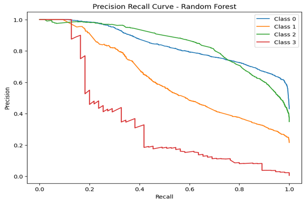

# Experimental Evidence

## Overview

This directory contains selected figures from the original cybersecurity incident classification research.

The evidence documents the experimental pipeline and model-evaluation results used to compare Random Forest, Gradient Boosting, and XGBoost for cybersecurity incident classification.

The figures cover:

- Classification architecture
- MITRE ATT&CK technique distribution
- Model accuracy comparison
- Random Forest confusion matrix
- Feature importance
- ROC analysis
- Precision-recall analysis

> **Evidence standard:** These figures represent results from the original dissertation experiment. They should not be interpreted as production SOC performance or as results reproduced from the repository notebook's current configuration.

---

## 01 — Classification Framework


### Purpose

This figure presents the architecture of the experimental cybersecurity incident classification pipeline.

The workflow progresses through:

```text
Microsoft GUIDE Dataset
        │
        ▼
Data Preprocessing
        │
        ▼
Text Preparation
        │
        ▼
Feature Engineering
   ┌───────────────┐
   │               │
TF-IDF        Transformer
Features       Embeddings
   │               │
   └───────┬───────┘
           ▼
    Combined Features
           │
           ▼
     Train-Test Split
           │
           ▼
          SMOTE
           │
           ▼
Machine-Learning Models
   ┌────────┼────────┐
   ▼        ▼        ▼
Random   Gradient   XGBoost
Forest   Boosting
   └────────┼────────┘
            ▼
     Model Evaluation
            │
            ▼
        Best Model
```

### Demonstrates

- End-to-end experimental workflow
- Hybrid NLP feature engineering
- Use of transformer-derived representations
- Class-imbalance handling using SMOTE
- Comparative evaluation of three classifiers

### Does Not Demonstrate

- Production deployment
- Real-time SOC integration
- Live incident ingestion
- Automated incident containment

---

## 02 — MITRE ATT&CK Technique Distribution


### Purpose

This figure shows the frequency distribution of the most common MITRE ATT&CK techniques represented within the analysed cybersecurity dataset.

The distribution is highly uneven.

An `Unknown` category represents a substantial proportion of observations, while several identified ATT&CK techniques occur considerably less frequently.

### Demonstrates

- MITRE ATT&CK-related information within the source dataset
- Uneven distribution of ATT&CK technique labels
- Potential challenges caused by underrepresented attack behaviours
- Security context available to the classification pipeline

### Interpretation

The imbalance is relevant because machine-learning models generally learn more effectively from categories with greater representation.

Less frequently represented ATT&CK techniques provide fewer examples from which predictive relationships can be learned.

### Limitation

This figure does **not** demonstrate that the project created a complete independent MITRE ATT&CK technique-classification engine.

ATT&CK-related information available within the Microsoft GUIDE dataset was used as cybersecurity context within the experimental workflow.

---

## 03 — Model Accuracy Comparison


### Purpose

This figure compares the reported test-set accuracy of the three supervised classifiers.

The dissertation reports:

| Model | Accuracy |
| --- | ---: |
| **Random Forest** | **69.28%** |
| XGBoost | 67.99% |
| Gradient Boosting | 65.61% |

### Demonstrates

- Random Forest achieved the highest reported accuracy
- XGBoost produced competitive performance
- Gradient Boosting ranked third
- No model achieved exceptionally high overall accuracy

### Interpretation

Random Forest produced the strongest overall result, but the difference between the three models was relatively modest.

The figure should therefore be interpreted as a comparative experimental result rather than evidence that Random Forest universally outperforms the other algorithms.

### Important Limitation

Accuracy alone does not describe class-level performance.

The confusion matrix and precision/recall results show that some incident classes were substantially more difficult to classify than others.

---

## 04 — Random Forest Confusion Matrix


### Purpose

The confusion matrix provides a detailed view of how Random Forest predictions were distributed across the four incident classes.

The reported matrix is:

```text
                 Predicted
              0      1      2      3
          ┌──────────────────────────
Actual 0  │ 3450   478    220    157
Actual 1  │  649  1058    369     80
Actual 2  │  710   358   2382     34
Actual 3  │   12     3      2     38
```

### Class 0

Correct predictions:

```text
3450 / 4305
```

Class 0 demonstrated comparatively strong performance.

### Class 1

Correct predictions:

```text
1058 / 2156
```

The model showed considerable confusion between Class 1 and neighbouring classes.

### Class 2

Correct predictions:

```text
2382 / 3484
```

Class 2 also demonstrated comparatively strong classification performance.

### Class 3

Only 55 true Class 3 observations were represented:

```text
12 + 3 + 2 + 38 = 55
```

Correct predictions:

```text
38 / 55
```

However, Class 3 had very low reported precision because many observations from other classes were also predicted as Class 3.

### Demonstrates

- Stronger performance for Classes 0 and 2
- Greater ambiguity for Class 1
- Severe minority-class representation for Class 3
- Why overall accuracy alone is insufficient

---

## 05 — Random Forest Feature Importance


### Purpose

This figure shows the twenty highest-ranked predictive features according to the Random Forest feature-importance calculation.

The ranked features include representatives from multiple feature families.

Examples include:

### TF-IDF-Derived Features

```text
TFIDF_293
TFIDF_294
TFIDF_171
TFIDF_295
TFIDF_286
```

### Transformer-Derived Features

```text
BERT_215
BERT_193
BERT_202
BERT_188
BERT_91
```

### Structured Metadata

```text
EntityType
```

### Demonstrates

- Predictive contribution from textual features
- Contribution from transformer-derived dimensions
- Contribution from structured cybersecurity metadata
- The hybrid nature of the feature representation

### Important Interpretation

Feature names such as:

```text
TFIDF_293
BERT_215
```

represent numerical feature positions.

They should not automatically be interpreted as directly meaningful cybersecurity concepts.

TF-IDF positions require mapping back to the vectorizer vocabulary for human-readable interpretation.

Transformer embedding dimensions are generally not individually interpretable as specific semantic concepts.

Feature importance therefore represents **predictive contribution**, not causal significance.

---

## 06 — Random Forest ROC Curves


### Purpose

Receiver Operating Characteristic curves were used to evaluate the Random Forest classifier's ability to distinguish between the four incident classes.

The dissertation reports:

| Class | AUC |
| --- | ---: |
| Class 0 | 0.88 |
| Class 1 | 0.81 |
| Class 2 | 0.90 |
| Class 3 | 0.97 |

### Demonstrates

- Above-random discrimination for all reported classes
- Strong ROC separation for several classes
- Different discrimination behaviour between classes

### Important Interpretation

Class 3 achieved the highest reported ROC AUC:

```text
0.97
```

but its class-level precision was only:

```text
0.12
```

This apparent contrast is important.

A high ROC AUC does not automatically mean that a classifier will produce reliable operational predictions for an imbalanced class.

ROC results should therefore be interpreted alongside:

- Precision
- Recall
- F1-score
- Class support
- Confusion matrices
- Precision-recall curves

---

## 07 — Random Forest Precision-Recall Curves



### Purpose

Precision-recall analysis provides additional insight into model behaviour under class imbalance.

The curves show substantial differences between the incident classes.

The more highly represented classes maintain stronger precision-recall behaviour, while the minority class performs substantially worse.

### Demonstrates

- Uneven classification performance across classes
- Impact of class imbalance
- Difference between majority- and minority-class behaviour
- Why ROC analysis should not be used alone

### Interpretation

Precision-recall analysis is particularly relevant to cybersecurity because security datasets frequently contain:

- Rare incident categories
- Uneven attack distributions
- High-cost false positives
- High-cost false negatives

The weaker minority-class performance demonstrates that additional work would be required before considering the classifier suitable for operational security use.

---

# Evidence Summary

| Figure | Category | Primary Purpose |
| --- | --- | --- |
| 01 | Architecture | Experimental classification workflow |
| 02 | Dataset analysis | MITRE ATT&CK technique distribution |
| 03 | Model comparison | Random Forest vs Gradient Boosting vs XGBoost |
| 04 | Error analysis | Class-level prediction behaviour |
| 05 | Explainability | Predictive feature contribution |
| 06 | Evaluation | Multiclass ROC/AUC analysis |
| 07 | Evaluation | Precision-recall and imbalance analysis |

---

# Reported Performance Summary

The dissertation reports:

| Model | Accuracy | Weighted F1 | Cross-Validation Accuracy |
| --- | ---: | ---: | ---: |
| **Random Forest** | **69.28%** | **0.6963** | **75.96%** |
| XGBoost | 67.99% | 0.6862 | 74.97% |
| Gradient Boosting | 65.61% | 0.6653 | 71.98% |

Random Forest achieved the strongest overall reported performance.

However, the class-level evidence demonstrates that overall model performance was not uniform.

---

# Evidence Interpretation

The evidence supports the conclusion that the experimental pipeline learned meaningful predictive patterns from the cybersecurity incident dataset.

However, it also reveals important limitations.

### Supported Findings

The evidence supports that:

- Three ensemble classifiers were comparatively evaluated
- Random Forest achieved the strongest reported overall result
- TF-IDF features contributed predictive information
- Transformer-derived features contributed predictive information
- Structured cybersecurity metadata contributed predictive information
- Some incident classes were substantially easier to classify than others
- Class imbalance remained an important challenge
- Multiple evaluation metrics were required to understand model behaviour

### Not Established by This Evidence

The evidence does **not** establish:

- Production SOC performance
- Real-time cybersecurity detection accuracy
- Generalisation to every organisation
- Generalisation to every cybersecurity incident type
- Comprehensive MITRE ATT&CK classification
- Production-ready automated triage
- Replacement of human security analysts

---

# Reproducibility Note

These figures represent the results reported in the original dissertation experiment.

The dissertation describes an experimental sample of:

```text
50,000 cybersecurity incident records
40,000 training records
10,000 testing records
```

The preserved repository notebook currently contains a smaller configurable dataset-loading limit.

Therefore:

> Results produced by running the notebook exactly as currently configured should not automatically be assumed to reproduce the figures documented here.

The repository intentionally preserves the distinction between:

1. Original dissertation results
2. Original implementation code
3. Future reproduced results

---

# Related Documentation

- [Methodology](../docs/methodology.md)
- [Feature Engineering](../docs/feature-engineering.md)
- [Model Evaluation](../docs/model-evaluation.md)
- [Dataset Documentation](../data/README.md)
- [Original Notebook](../notebooks/cybersecurity-incident-classification.ipynb)

---

## Research Context

These figures are retained as evidence from an academic cybersecurity machine-learning experiment and are presented here as part of a professional technical portfolio.

They document both the strengths and limitations of the experimental approach rather than presenting the classifier as a production-ready security system.
